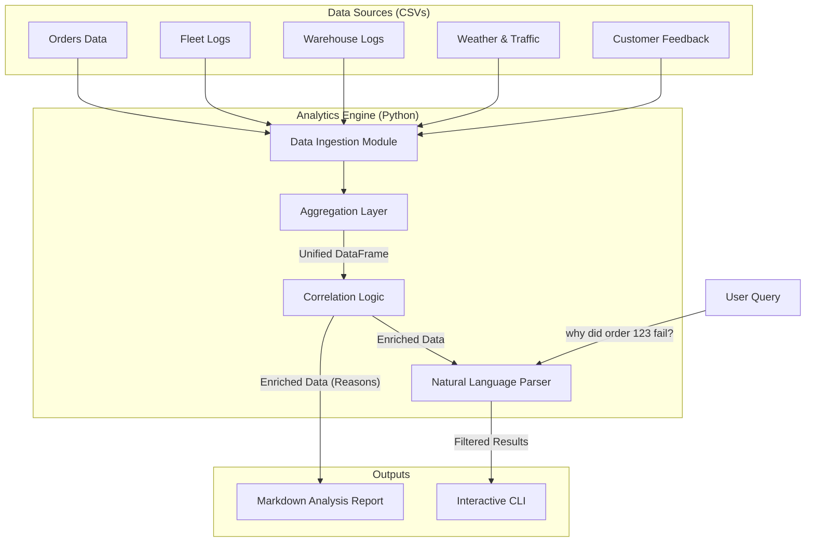

# Delivery Failure Analysis System - Solution Design

## 1. Problem Overview
Logistics operations suffer from data silos. Order data, fleet logs, warehouse records, and external factors (weather/traffic) exist in separate systems, making it difficult to understand *why* a delivery failed or was delayed. This solution aims to aggregate these disparate data sources to provide automated, actionable insights.

## 2. Solution Approach

The solution is a Python-based analytics engine that performs three key functions:

1.  **Data Aggregation**: Ingests structured data (CSVs) from multiple domains (Orders, Fleet, Warehouse, Clients, Weather) and joins them into a unified "Order Journey" dataset.
2.  **Event Correlation**: Time-aligns and links events. For example, matching a "Late" delivery status with a "Heavy Rain" weather record or a "Breakdown" fleet log for that specific order ID.
3.  **Insight Generation**: Applies heuristics to categorize failure reasons and surfaces them through an interactive Natural Language Interface (CLI) and comprehensive reports.

## 3. System Architecture

The following diagram illustrates the data flow and component interaction:

## 4. Key Components

### A. Data Integration Strategy
We use `orders.csv` as the central fact table. All other datasets are joined using `order_id` or entity IDs (`client_id`, `driver_id`, `warehouse_id`).
*   **Conflict Resolution**: When multiple logs exist for an order (e.g., multiple GPS pings), we select the most relevant record (e.g., the last log before delivery) to capture the final status.

### B. Root Cause Heuristics
The system determines the "Consolidated Reason" for a failure by checking attributes in priority:
1.  **Fleet Issues**: Is there a specific GPS delay note (e.g., "Vehicle Breakdown")?
2.  **Warehouse Issues**: Is there a warehouse exception note (e.g., "Stockout")?
3.  **External Factors**: Was the weather "Rain" or "Fog"? Was traffic "Heavy"?
4.  **Customer Feedback**: Did the customer mention "Wrong Address"?

### C. Natural Language Interface
A lightweight logic-based parser maps user questions to system commands:
*   *"Compare Mumbai and Delhi"* -> Triggers City Comparison module.
*   *"Why did order 847 fail?"* -> Triggers Single Order Analysis.
*   *"Top reasons for Warehouse 1"* -> Applies Warehouse Filters.

## 5. Potential Extensions
*   **Real-time Ingestion**: Connect to Kafka/Database streams instead of static CSVs.
*   **ML Prediction**: Train a classifier to predict *future* delays based on historical correlations.
*   **Web Dashboard**: Visualize the insights using a frontend framework (React/Streamlit).
